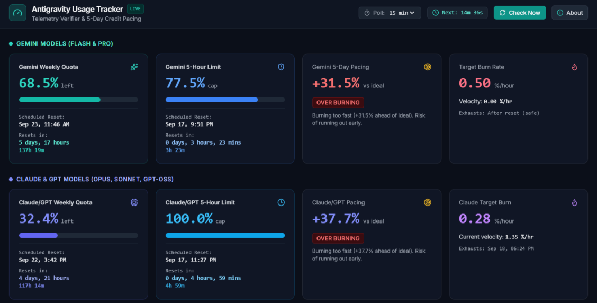
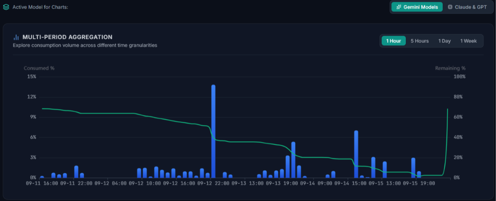
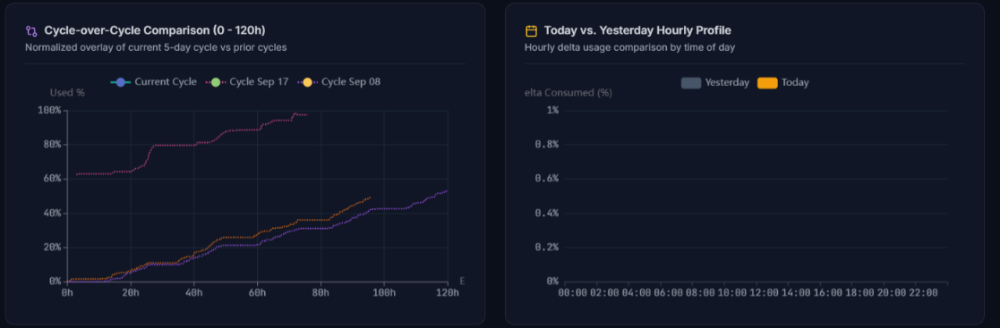
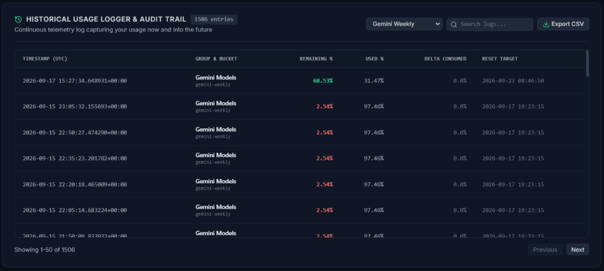

# ⚡ Antigravity Usage Tracker

A lightweight, dedicated background telemetry monitor, analytical audit logger, and visual dashboard application for Google Antigravity (`agy`).

---

## 📸 Visual Overview

### 1. Real-Time Quota & 5-Day Pacing Dashboard
Comprehensive overview tracking Gemini Models (Flash & Pro) and Claude & GPT Models (Opus, Sonnet, GPT-OSS). Displays real-time quota remaining, 5-hour rolling limits, linear pacing variance corridor (±5%), target burn rates, velocity, and scheduled reset times with dual countdowns (days/hours and total hours/minutes).



---

### 2. Multi-Period Aggregation Charts
Interactive multi-period consumption history allowing you to switch between **1 Hour**, **5 Hours**, **1 Day**, and **1 Week** views. Combines bar charts for consumed volume with a smooth trendline for remaining quota percentage.



---

### 3. Cycle-over-Cycle Comparative Analysis & Hourly Profiles
* **Cycle-over-Cycle Comparison (0 - 120h)**: Normalizes past and present 5-day cycles onto a single timeline to visualize your burn trajectory against prior periods.
* **Today vs. Yesterday Hourly Profile**: Side-by-side hourly breakdown comparing coding prompt volume across time of day.



---

### 4. Historical Usage Logger & Audit Trail
A persistent ledger recording every snapshot timestamp, model group, bucket, remaining %, used %, delta consumed, and reset target. Features fast instant search, model filtering, pagination, and one-click **Export CSV**.



---

## 📖 How the App Works

### 1. Zero-Cost Telemetry Ingestion Pipeline
The application retrieves real-time quota telemetry directly from your local Antigravity installation using a native CLI diagnostic command:

```powershell
agy -p "/usage" --output-format json
```

* **Zero Token Consumption**: The `/usage` command is handled entirely locally by the Antigravity agent harness as an internal status query. It does **not** invoke LLM models, incur API fees, or consume prompt quota.
* **Structured Data Extraction**: Antigravity returns a JSON payload containing active quota buckets:
  * **Gemini Models**: Weekly Quota & 5-Hour rolling rate limit (`gemini-weekly`, `gemini-5h`).
  * **Claude & GPT Models**: Weekly Quota & 5-Hour rolling rate limit (`3p-weekly`, `3p-5h`).
  * For each bucket, the system extracts `remaining_fraction` (e.g. `0.72` = 72% remaining) and `reset_time` (ISO-8601 UTC timestamp).

#### 2. Completely Silent Background Execution (Windows)
When background tasks execute CLI commands on Windows, spawning a shell normally causes a brief black `cmd.exe` console window to flash on screen. 

To eliminate this, [`tracker/collector.py`](tracker/collector.py) uses Windows-native process creation flags:

```python
if sys.platform == "win32":
    extra_kwargs["creationflags"] = subprocess.CREATE_NO_WINDOW
    si = subprocess.STARTUPINFO()
    si.dwFlags |= subprocess.STARTF_USESHOWWINDOW
    si.wShowWindow = 0  # SW_HIDE
    extra_kwargs["startupinfo"] = si
```

* **`CREATE_NO_WINDOW` & `SW_HIDE`**: Ensures that every scheduled check executes 100% headlessly in the background without stealing focus or displaying terminal windows.

### 3. Background Poller & Dynamic Scheduler
Implemented in [`tracker/server.py`](tracker/server.py):

* **Configurable Timer**: An asynchronous loop runs at the interval defined in `config.json` (default: **15 minutes**).
* **Instant Dynamic Adjustment**: Selecting a new interval (**1m, 5m, 10m, 15m, 30m, 60m**) from the dashboard top bar updates the timer and reschedules the next check on-the-fly without restarting the service.
* **On-Demand Polling**: Clicking **"Check Now"** (`POST /api/poll`) triggers an immediate snapshot and updates the dashboard instantly.

### 4. Storage & Historical Audit Trail
Implemented in [`tracker/database.py`](tracker/database.py):

* **SQLite in WAL Mode**: High-performance local storage (`usage_tracker.db`) utilizing Write-Ahead Logging for concurrent non-blocking reads and writes.
* **Snapshot Ledger**: Every poll records the timestamp, model group, bucket ID, remaining percentage, delta consumed since previous reading, and target reset time.
* **Audit Logger & Export**:
  * Filter snapshots by model/bucket or keyword.
  * Interactive pagination.
  * **Export to CSV** for custom analysis, spreadsheets, or archiving.

### 5. Pacing Engine & Mathematical Model
Implemented in [`tracker/pacing_engine.py`](tracker/pacing_engine.py):

* **Linear Ideal Path**: Computes $U_{\text{ideal}}(t) = \left(\frac{t - T_{\text{start}}}{D_{\text{cycle}}}\right) \times 100\%$ representing even consumption across the quota period.
* **Variance Delta ($\Delta$)**: $\Delta = \text{Actual Used } \% - \text{Ideal Used } \%$.
  * **Over-burning** ($\Delta > +5\%$): Consuming too fast; risks running out before reset.
  * **On Track** ($-5\% \le \Delta \le +5\%$): Perfectly aligned with the 100% budget corridor.
  * **Under-burning** ($\Delta < -5\%$): Consuming slower than allocated; safe to increase usage.
* **Target Burn Rate**: Dynamically calculates the exact `% / hour` required to exhaust remaining quota precisely at the moment of reset.
* **Dual Time Display**: Every card displays both human-friendly units and total hours/minutes:
  ```text
  Scheduled Reset:
  Sep 17, 10:23 PM
  Resets in:
  3 days, 7 hours
  79h 3m
  ```

---

## 🚀 Getting Started

### 1. Installation & Launch
Clone the repository and install dependencies:

```bash
git clone https://github.com/ygreq/AntigravityUsageTracker.git
cd AntigravityUsageTracker
pip install -r requirements.txt
```

Launch the dashboard via double-clicking `run_tracker.bat` (Windows) or running:

```bash
python -m tracker.server
```

Open your browser at: **`http://127.0.0.1:8778`**

### 2. Terminal CLI Commands
You can also query status or trigger checks directly from any terminal:

* **View live quota status & pacing summary**:
  ```bash
  python -m tracker.cli status
  ```

* **Trigger an immediate manual poll**:
  ```bash
  python -m tracker.cli poll
  ```

---

## 📁 Project Architecture

```
AntigravityUsageTracker/
├── config.json                 # Polling intervals, server port, bucket configurations
├── requirements.txt            # Python dependencies (fastapi, uvicorn, rich)
├── run_tracker.bat             # Desktop launcher script
├── README.md                   # Complete documentation & system architecture
├── WALKTHROUGH.md              # Feature verification and changelog
├── printscreens/               # UI dashboard screenshots
├── tracker/
│   ├── __init__.py
│   ├── collector.py            # Headless execution of agy CLI & data extraction
│   ├── database.py             # SQLite schemas, audit trail queries & CSV export
│   ├── pacing_engine.py        # Pacing math, burn rates, and countdown calculations
│   ├── aggregator.py           # Multi-period aggregations (1h, 5h, 1d, 1w)
│   ├── server.py               # FastAPI backend & asynchronous poller task
│   └── cli.py                  # Rich terminal CLI dashboard
└── web/
    ├── index.html              # Dark-mode dashboard (Tailwind CSS, Lucide icons)
    └── app.js                  # ECharts visualizations, countdown ticker & log UI
```
